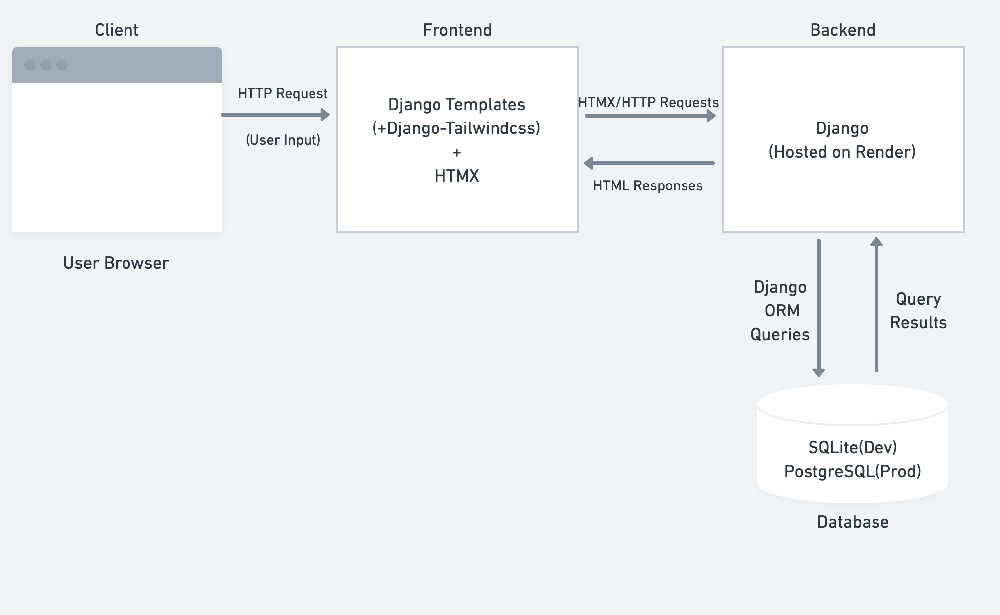
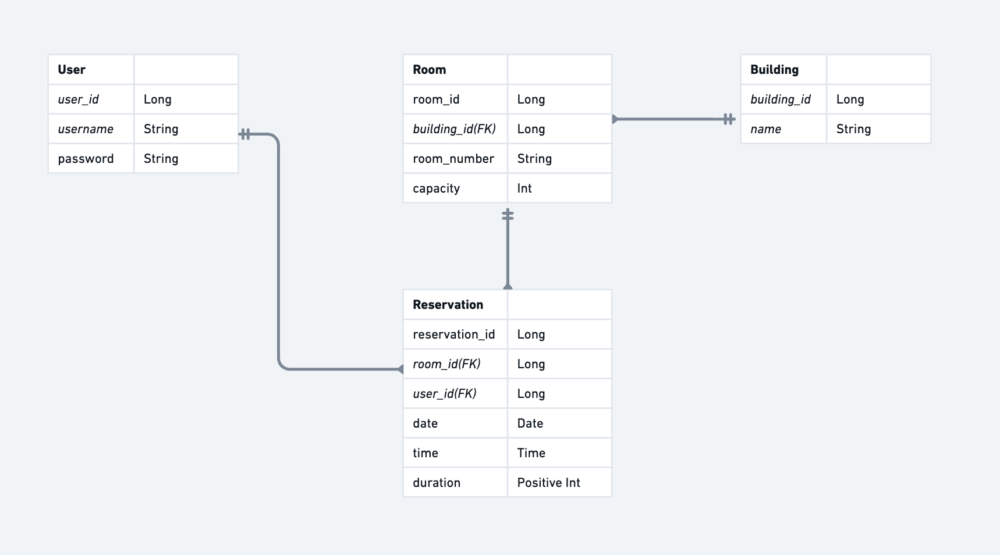
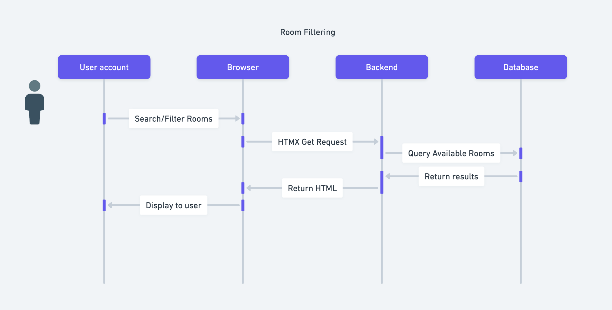

# where2Sit Architecture

## Component Diagram

As shown in the diagram, the user interacts through the browser, prompting a request through our frontend which passes it on to our Django backend. The backend handles logic and requests which communicates with our database that stores room and reservation data. For development, we are continuing to use Django's default SQLite with plans to convert to PostgreSQL in production should we reach that step in order to better work with our Render deployment.

## ERD

This diagram shows the relationship between entities in where2sit. Rooms belong to buildings and of course there can be multiple rooms within a building. Users interact with rooms by making reservations in a one to many format. And of course, any one room can have many reservations. Foreign keys are used for entities in direct relation.

## Call Sequence Diagram

The chosen feature is room filtering for the diagram above. User filter rooms with their desired criteria through the UI. Frontend sends the request via HTMX. The backend processes the logic, queries the database, and returns the result after the database returns the filtered room data.
