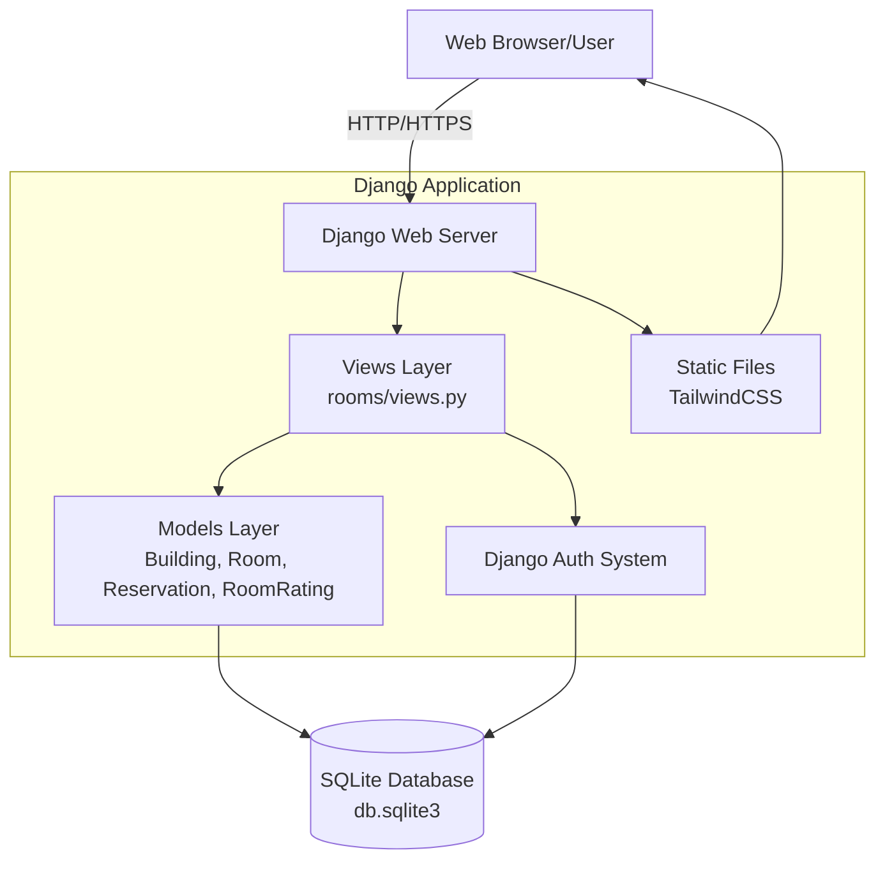
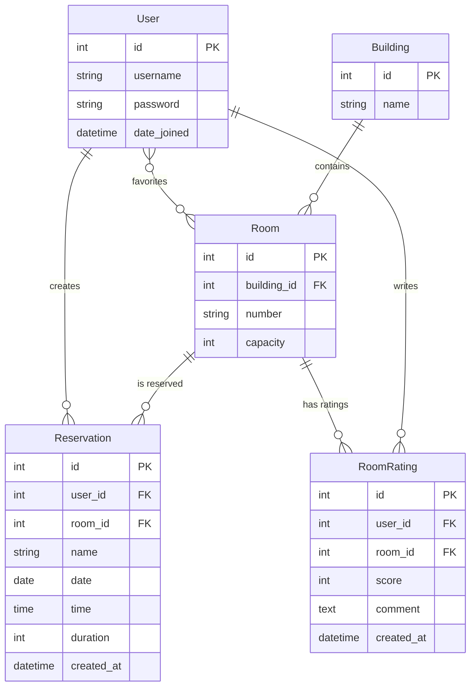
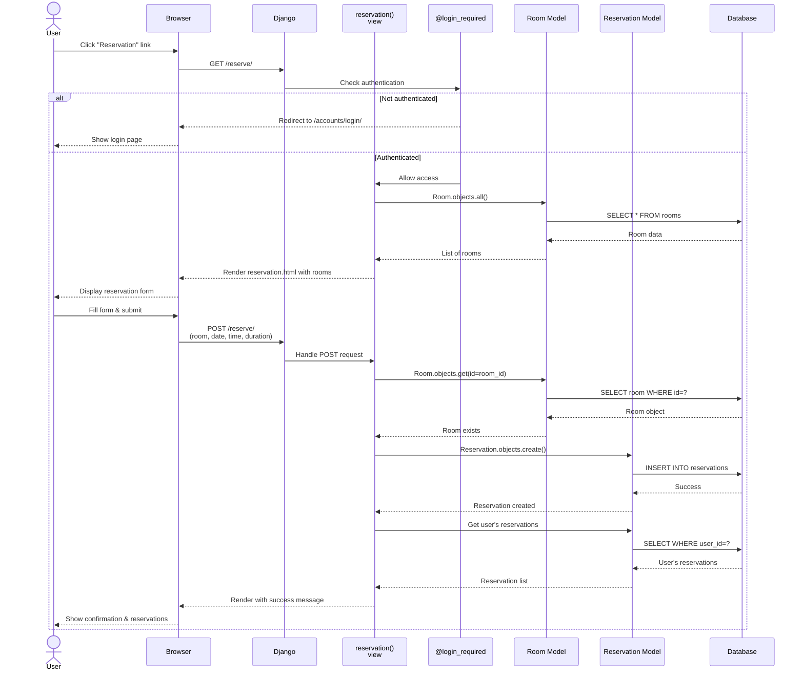

# Where2sit Architecture

## 1. High-Level Component Diagram

The where2sit application follows a traditional Django MVC architecture. Users interact with the
system through a web browser, sending HTTP requests to the Django web server. The Views layer
handles incoming requests and coordinates between the Models layer and templates. The Models layer
consists of four main entities: Building, Room, Reservation, and RoomRating, which interact with
the SQLite database. Django's built-in authentication system manages user login, registration,
and session management. Static files (primarily TailwindCSS) are served to provide the user interface
styling. All database interactions flow through Django's ORM, ensuring data consistency and security.

## 2. Entity Relationship Diagram

The reservation system's data model centers around five main entities. A Building contains multiple
Rooms (one-to-many relationship). Users can create multiple Reservations for different Rooms
(many-to-one relationships). The system also supports a many-to-many relationship between Users and
Rooms through the favorites feature, allowing users to mark their preferred study spaces. Users can
write RoomRatings for Rooms they've used, establishing another many-to-one relationship. When a
Building is deleted, all associated Rooms are cascade-deleted, which in turn deletes all Reservations
and RoomRatings for those rooms. Similarly, when a User is deleted, their Reservations and RoomRatings
are removed, but the Rooms themselves remain intact.

## 3. Sequence Diagram

The room reservation flow begins when an authenticated user navigates to the reservation page. The
@login_required decorator checks authentication status; unauthenticated users are redirected to
login. Once authenticated, the view retrieves all available rooms from the database via the Room
model and renders the reservation form. When the user submits the form with room selection, date,
time, and duration, a POST request is sent to the server. The view validates that the selected room
exists by querying the database, then creates a new Reservation object linking the user to the room
with the specified time details. After successful creation, the view queries the user's reservations
to display them on the same page, providing immediate feedback. If any error occurs (such as an invalid
room ID or missing fields), the view catches the exception and displays an error message without
creating the reservation.
