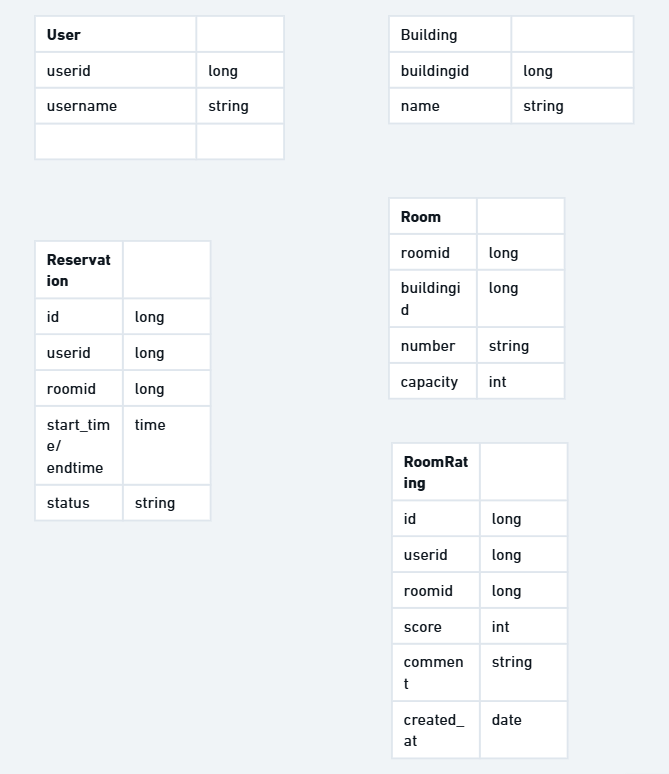
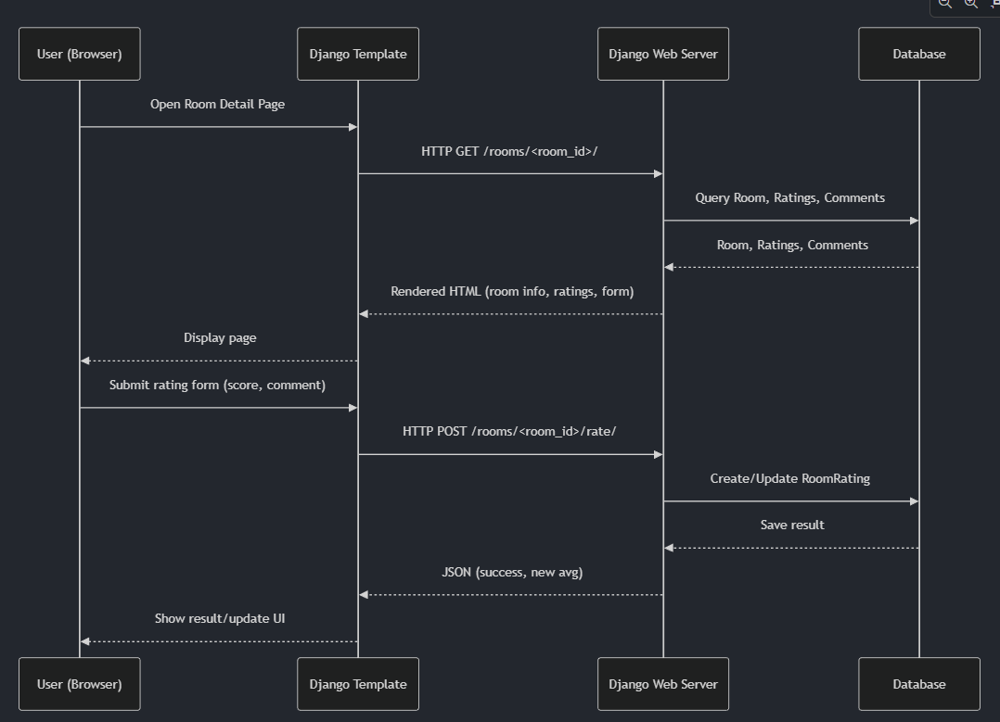

# where2sit Architecture

## Overview

where2sit is a Django-based web application designed to improve the visibility and flexibility of campus spaces. The system supports room booking, availability checking, user ratings, comments, and favorites, serving students, faculty, and administrators.

The provided diagram outlines a typical web architecture for a Django application, illustrating how data and requests flow between the user and various backend services. Here is a breakdown of the components and their interactions:

Web-Client and Nginx: The user (web-client) initiates the process. For static assets like CSS, JavaScript, or images, the client interacts directly with Nginx. This offloads the burden of serving simple files from the main application server, improving efficiency.

Django Web Server: For dynamic content, the client sends an HTTP request to the Django Web Server. This acts as the "brain" of the operation, processing logic and coordinating between other systems. It is also connected to Nginx to manage how static files are collected or served.

Database and Third-Party Services: To fulfill a request, the Django server communicates with a Database to retrieve or store persistent data (like user profiles or posts). Simultaneously, it can reach out to Third-party services via external APIs—such as payment gateways or social media integrations—to extend the application's functionality beyond its own codebase.

## Diagram

The provided schema defines a structured system for managing room bookings and user feedback. At the top of the hierarchy, the Building entity serves as a parent to various Rooms, which are linked by a shared buildingid. Users act as the primary agents in this ecosystem, interacting with rooms through two relational entities: Reservation and RoomRating. While the Reservation table handles the logistics of scheduling—tracking who booked which room and when—the RoomRating table captures the qualitative side, linking users to rooms through scores and comments. Together, these entities create a cohesive map of physical assets, the people using them, and the transactional data generated by those interactions.
## Diagram

### Room Rating Feature Call Sequence

The diagram above illustrates the call sequence for the room rating feature:
- The user opens the room detail page, which triggers a GET request to the Django server.
- The server queries the database for room details, ratings, and comments, then renders the page.
- When the user submits a rating, the browser sends a POST request to the server.
- The server creates or updates the RoomRating in the database and returns a JSON response.
- The frontend updates the UI to reflect the new rating.

This sequence ensures a smooth user experience and keeps the data consistent between the frontend and backend.

