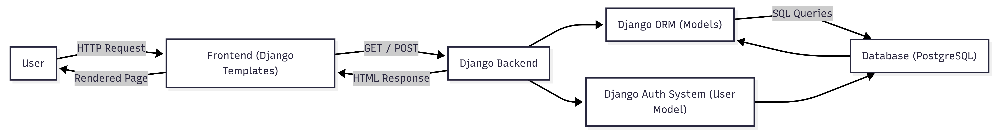
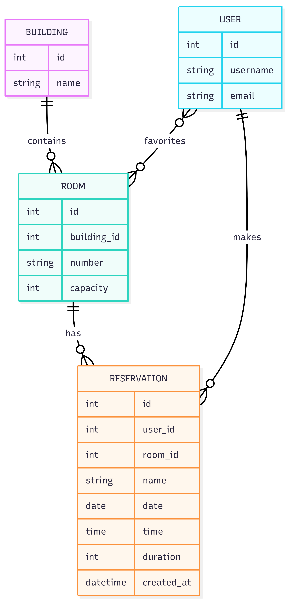
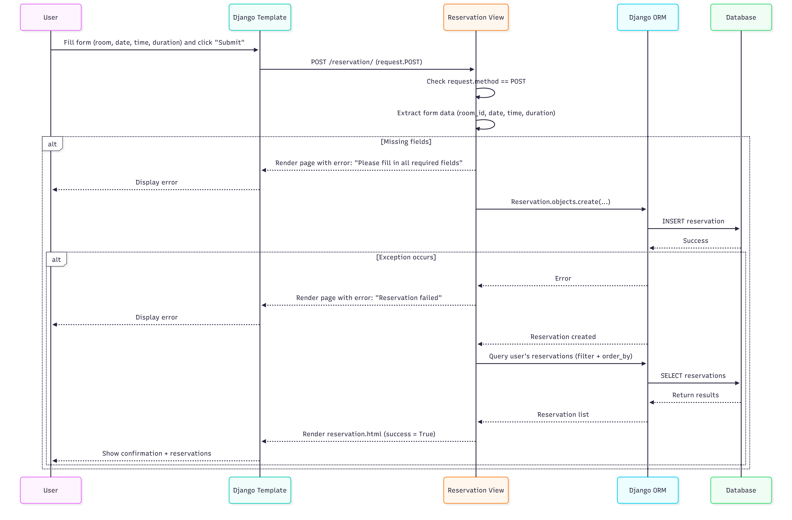

# System Architecture

## High-level Component Diagram

The where2sit application follows a client-server architecture built using Django. Users interact with the system through a web browser, which renders the frontend using Django templates. The frontend sends HTTP requests (GET and POST) to the Django backend.

The Django backend contains the application’s core logic, implemented in views. These views handle user actions such as browsing rooms, making reservations, and managing favorites. The backend uses the Django ORM to interact with the PostgreSQL database, translating Python objects into SQL queries.

The database stores data including buildings, rooms, reservations, and user information. User authentication is handled by Django’s built-in authentication system, which manages login, registration, and user sessions.

Overall, the system processes user requests through the frontend, applies business logic in the backend, and retrieves or updates data in the database before returning a response to the user.

## Entity Diagram

The data model consists of entities such as Building, Room, Reservation, and User.

A Building contains multiple Rooms, and each Room belongs to exactly one Building. Rooms represent the main resource that users interact with in the system.

The Reservation entity connects Users and Rooms. Each reservation is made by a single user for a specific room, date, time, and duration. This allows the system to track bookings and manage room usage over time.

There is also a many-to-many relationship between User and Room, which represents favorite rooms. Users can mark rooms as favorites, and each room can be marked as favorite by multiple users.

This data model supports the core functionality of the application, including browsing rooms, making reservations, and saving preferred rooms.

## Call Sequence Diagram of Reservation

The sequence diagram illustrates the reservation process. A user begins by filling out a reservation form in the browser and submitting it. This sends a POST request to the Django backend.

The backend view processes the request by extracting form data such as room, date, time, and duration. It validates that all required fields are provided. If any data is missing, the system returns an error message and re-renders the page.

If the input is valid, the backend uses the Django ORM to create a new reservation in the database. If an error occurs during this process, an error message is returned to the user. Otherwise, the reservation is successfully saved.

After creating the reservation, the system retrieves the user’s existing reservations and returns an updated page showing a success message along with the reservation list.