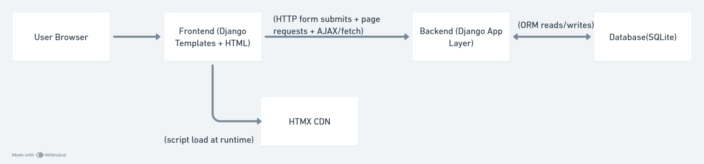
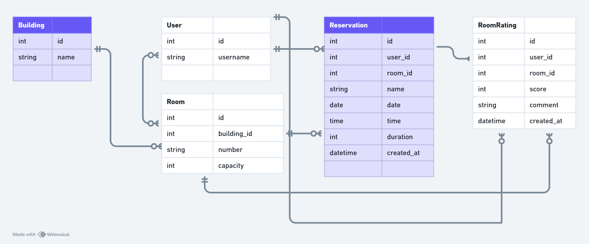

where2sit Architecture

The system is organized into a browser based frontend, a Django backend, a SQLite database, and an external HTMX CDN dependency. Users interact through Django rendered HTML templates, which send page requests, form submissions, and AJAX/fetch calls to the Django application layer. On the backend, Django Auth handles login/session access control while the Rooms app views and models process room listing, reservations, favorites, and ratings using Django ORM. The backend reads and writes application data in SQLite, and the frontend also loads HTMX from CDN at runtime to support client-side interaction behavior.

The application uses five entities to model its core data. Building represents a physical location and has a one-to-many relationship with Room, meaning each building contains multiple rooms, each storing a room number, capacity, and a foreign key back to its building. User stores authenticated users and relates to three other entities: a user can make many Reservations, give many RoomRatings. Reservation links a user to a room for a specific date, time, and duration, capturing both foreign keys alongside booking details. RoomRating also links a user to a room, storing a score and optional comment.

